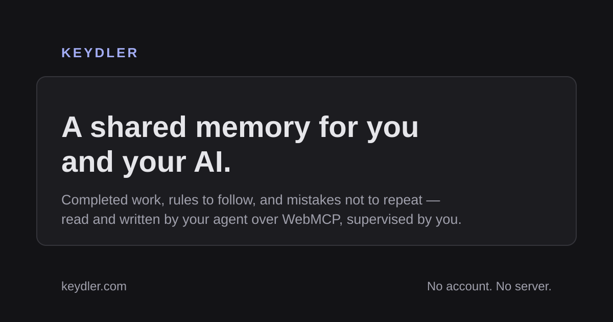

# Keydler

**A shared memory for you and your AI. It keeps completed work, rules to
follow, and mistakes not to repeat — even when the conversation changes.**

> Conversations reset. The work should not.

**[keydler.com](https://keydler.com)** · [How it works](#why-webmcp-is-the-point)
· [The thirteen tools](#the-tools) · [Documentation](docs/) ·
[Security](SECURITY.md)

No account, no server, no network calls. Everything stays in the browser, and
the page is the tool surface an agent talks to.



---

## The problem

When an agent loses its context, it does not just lose information. **It loses
the prohibitions.**

It re-proposes the approach you already ruled out. It reintroduces the
dependency you refused. It redoes work it no longer remembers doing. A
conversation summary keeps the highlights and sacrifices exactly what
constrains — because a constraint reads like a detail right up until someone
breaks it.

Keydler takes that constraint out of the conversation and puts it on a web
page: rules in force, work done with its evidence, approaches ruled out with the
reason why, and the next action. A new conversation reads it and continues from
the right place. You correct it while the agent works.

## Try it in three steps

```bash
npm install && npm run dev
```

1. Open the page and click **Try the demo** — or **Create a task** and give it a
   title, a next action, and one rule.
2. Open the same page with a WebMCP-enabled agent and say **“Continue this
   task.”**
3. While the agent works, add a rule. Its next write is refused, it re-reads the
   log, and it adapts.

Step 3 is the whole product.

## Why WebMCP is the point

Keydler is not a notes app with an API bolted on. **The page is the tool
surface**, and that is only possible because of WebMCP:

- The task memory lives where the human can see and correct it — a page, not a
  server-side store the human never looks at.
- The agent reads and writes **the same state the human is editing**, in the
  same instant, with no synchronisation layer between them.
- Tool descriptions travel with the page, so the agent learns _when_ to call
  `resume_task` from the page itself rather than from a system prompt someone
  had to write in advance.
- There is no backend to run, no account to create, and nothing leaves the
  device.

Take WebMCP away and the agent has to infer state from the interface and
manipulate it indirectly. With WebMCP, it receives typed operations and a
compact canonical state.

## Human and agent, deliberately asymmetric

|                      | Human                                       | Agent                                    |
| -------------------- | ------------------------------------------- | ---------------------------------------- |
| Writes               | never refused                               | must carry the version it read           |
| Rules and rejections | binding immediately                         | **proposals** until a human accepts them |
| Evidence             | approving it is the only path to “verified” | can attach, never verify                 |
| Closing a task       | can always reopen                           | closing is not final                     |

That asymmetry is the supervision. An agent that could forbid an approach on its
own authority would close off the right answer for every conversation that
follows — silently, and with no way to notice.

## What it looks like

**First visit**


**An active task** — next action, work with its confidence, binding rules,
ruled-out approaches, agent proposals awaiting a decision, evidence to review,
and the whole history


**Or send it sealed.** A protected link is encrypted with a passphrase you give
the other person another way — the same AES-GCM 256 and PBKDF2-SHA256 at 600 000
iterations the credential vault uses, no new cryptography. Until the phrase is
entered, nothing about the log can be read, not even its name. A sealed link
left in a chat log is a block of ciphertext.

What it does **not** do, and the screen says so: it cannot tell who opens it.
A URL fragment is a bearer capability, and checking an identity would need a
server this product does not have. What a passphrase proves is knowledge of a
secret, which is a different thing and the strongest thing available without one.

**Send the whole log in a link.** No server sees it — the log rides in the URL
fragment, which browsers never transmit. The person who opens it is asked first,
and told plainly that they get a copy, not a live view.


**The agent asks permission, and waits.** `request_approval` blocks until a human
clicks. This is the one thing a page can do that a server cannot: there is
somebody at the other end.


If nobody answers within the window, the call comes back `NO ANSWER` — never
`ALLOWED`. The reply says it in as many words: _no answer is not approval,
treat it exactly as a refusal_. The request stays on the page for when you
return.

**One bar tells you what needs you.** The human-side answer to `resume_task`:
what is unresolved, in the order it costs to miss, each one a link to the card
that holds it


**You can say an agent is wrong.** Approving evidence was always possible;
refusing it was not. A disputed step carries your reason forever, stops counting
as proven, and reaches the next conversation as `DISPUTED BY THE HUMAN — treat
as wrong`


**An agent stops rather than guess.** Its question sits between the next action
and the work, with the reason it is blocked. Your answer goes back into
`resume_task`, so the next conversation reads it instead of guessing again. Note
the claimed step offering **Attach evidence** — proof often arrives later.


**A human interrupts, mid-work.** The human adds a rule; the agent’s next write
is refused as stale; the page says so in plain language, and the history records
the attempt alongside the rule that caused it.


**You come back, and the page tells you what happened.** It counts the tab as
away when it is hidden, so switching to your agent and back is enough


**Did the agent read before writing?** Counted from the calls the page observed,
not asserted


**Search** covers the open task and every other one — including a rejection
found by its _reason_, and a step found by the content of its evidence


**Light, dark, or whatever the system says**


## The tools

Four read, nine write. The count is not a goal — each tool dilutes the list an
agent must read in order to choose, so each has to pay for itself.

| Tool               | Role                                                                             |
| ------------------ | -------------------------------------------------------------------------------- |
| `resume_task`      | The canonical state, under 400 tokens: id, version, rules, rejections, next step |
| `what_changed`     | What was written since the version you hold — the cheap answer to a stale write  |
| `read_task_detail` | Paginated detail — whole evidence, whole reasons, older work, credential names   |
| `search_task`      | “Have we already tried this?” — one term across steps, evidence, rules, refusals |
| `log_step`         | Record a completed step and its evidence                                         |
| `add_constraint`   | **Propose** a rule                                                               |
| `reject_approach`  | **Propose** ruling out an approach, reason mandatory                             |
| `add_decision`     | The “why”, which every summary loses first                                       |
| `ask_human`        | Record a blocking question instead of guessing — the next conversation sees it   |
| `request_approval` | Ask permission for something irreversible, and **wait** for the human to decide  |
| `attach_evidence`  | Proof that arrived after the step was logged                                     |
| `set_next_action`  | Redirect the task without inventing a step to hang it on                         |
| `complete_task`    | Close with a hand-over summary                                                   |

## Credentials the agent can name but not read

An agent often needs to know that a secret _exists_ — which one, and what it is
for — without ever seeing it. Any secret, not just an API key: tokens,
passwords, connection strings, webhook URLs, private keys, certificates.
Keydler holds the reference:

```
CREDENTIALS — names only, values sealed (2)
  ${gemini-api-key} — Calls the Gemini API from the ingestion script
  ${deploy-signing-key} — Signs the deploy bundle
  Write these as ${name}; no tool here returns a value.
```

The agent writes `${deploy-signing-key}` where the value belongs. You wire the
real one. `read_task_detail` on the `credentials` section lists every name with
its kind, so a summary that had to cut the list never loses one.


- The value is sealed with **AES-GCM**, under a key derived from a passphrase by
  **PBKDF2-SHA256, 600 000 iterations**, with a fresh salt and IV per secret.
  Web Crypto only — no new dependency.
- The passphrase is **never stored**, and the plaintext is never persisted.
- Secrets live in a **separate store, outside the task state**. That is what
  makes the guarantee structural rather than careful: no tool result, no export,
  and no `resume_task` reply can contain a value, because the task object never
  holds one. There is a test that calls every tool and asserts it.
- Revealing a value takes an explicit click **and** the passphrase, and it hides
  itself again after 45 seconds.
- A **private key or certificate spans several lines**, so the field becomes a
  textarea for those kinds — an `<input>` would silently keep only the first
  line, and nothing would say so until the key was used.
- Two credentials cannot share a name: `${name}` is all the agent gets, and two
  of them would make the reference ambiguous.

**What this is not.** It is not an audited secret manager, and it does not
defend against everything:

- Anything you **reveal on screen** can be read by an agent that drives this
  browser — screenshots and DOM reads see what you see.
- Any script running on this origin can read the sealed blob. Encryption at rest
  protects the stored bytes, not a compromised page.
- For production credentials, use a real secret manager. This is for wiring up a
  task without pasting a key into a conversation.

## What else is on the page

Credentials the agent can name but never read, the activity counter, search
across every task, the history of refused writes — every panel and the reason
it exists are laid out in **[docs/interface.md](docs/interface.md)**.

## Audits

[`docs/concours.md`](docs/concours.md) is what nine agents
established about the challenge itself from primary sources — the deadline
freeze that is not on the rules page, the video requirements that are stricter
than they look, and the uncomfortable finding that "the agent proposes, the
human decides" is the single most crowded pitch in the field rather than a
differentiator. It also lists, at length, what could not be established.

[`docs/echelle.md`](docs/echelle.md) is a cost pass rather
than a defect pass: what grows without bound, what redoes work, what stops being
usable as the log fills. It found that `resume_task` was overshooting its own
400-token budget by a factor of 94 on a task carrying two thousand rules —
because the degradation ladder trimmed history and never obligations. Keeping
every rule sounds principled until you measure it: a 37 800-token briefing is
truncated by the model's context window instead, in silence and out of reach.
Four dashboard lists had the same shape of problem. Every figure in it is
reproducible with `npm run bench`, and the "before" column comes from that same
harness run against the previous commit.

[`docs/audits/second.md`](docs/audits/second.md) is a second pass
aimed only at the features built after the first one — the shareable link, the
blocking approval, undo, the goal, the badges. It found that a link could carry
a decompression bomb: the size limit was enforced on the link this page
_produces_, and never on one it _receives_, while the link is opened by the
person you send it to. It also records two tests that were passing without
demonstrating anything, both caught by mutation testing.

[`docs/audits/premier.md`](docs/audits/premier.md) is the first: a full
defect hunt over the repository: static review, boundary probes, real-browser sequences including
two tabs at once, and thirteen mutation tests that break a guarantee in the
source and check the suite goes red. It lists what was found and fixed — sealed
credentials outlived the task that held them, the worst of the four — and, at
the same length, what is known and left alone.

## Technical guarantees

- **Stale writes are refused, never merged.** Every agent write carries the
  version it read. If the human changed the state since, the write is refused
  with an instruction to re-read. The comparison happens _inside_ the IndexedDB
  transaction, so two tabs cannot silently overwrite each other.
- **Retries never duplicate.** Each write carries a `mutation_id` plus a
  fingerprint of its arguments. The same id with the same arguments replays the
  original reply verbatim; the same id with _different_ arguments is refused and
  audited, rather than being acknowledged as work that never happened.
- **Confidence is derived, never declared.** An agent cannot mark its own output
  verified. Attaching evidence records that there is something to read; only a
  human who is shown the content and clicks can mark it verified.
- **Everything is audited**, including refusals, cancellations and collisions.
- **The tool lifecycle is conservative.** Tools follow the task state, but a tool
  is only _unregistered_ when the browser is known to do that safely
  (Chromium ≥ 153). Below that, tools stay registered and refuse cleanly —
  unregistering a tool that is mid-reply can drop that reply, and no timer trick
  makes that ordering safe.
- **The tool catalogue fits Chrome's published budgets.** Chrome recommends 30
  characters per tool name, 500 per tool description, 150 per parameter
  description and 1.5K per tool output — past those, agents hit their own
  guardrails. Ten of the thirteen descriptions were over, and one parameter was
  more than twice the limit, repeated on nine tools. A test now holds all four
  bounds, including a floor, so nothing is trimmed into silence to fit. Read
  back through `getTools()` in Brave 151: 16, 499 and 146 against limits of 30,
  500 and 150. The briefing is the one that does not fit — 1528 characters,
  1.9% over — and that overage is written down rather than shaved off.
- **The page is locked down at the edge.** `public/_headers` (Cloudflare Pages,
  Netlify) and `vercel.json` carry the same policy, and a test keeps them from
  drifting apart. The content policy starts at `default-src 'none'` and opens
  only this origin — the app makes no outbound request, loads no font, uses no
  `data:` image and sets no `style=` attribute, so nothing has to be opened for
  it. The one inline script, the theme bootstrap, is allowed by its hash;
  `unsafe-inline` never appears. Framing is refused outright, which is what
  stops a hidden frame making someone click **Allow** on an approval they
  cannot see. Verified in Brave against the built site: an injected inline
  script, a CDN script, an outbound `fetch`, a beacon image carrying the page
  title, and framing the page were all refused by the browser, with no console
  error from the app itself.
- **Two tabs stay in step.** A write announces itself on a `BroadcastChannel`;
  any other tab holding that task re-reads it from IndexedDB and redraws. The
  refusal machinery was already correct — a stale write is refused, and the
  message even names the other page — but until this, the second tab's screen
  went on showing a state that had moved. A page that lets a screen lie is the
  thing this product exists to object to.
- **One task, one address.** A task lives at `/t/:id`. A page bound to that
  address returns that task or says it is gone; it never substitutes “whatever
  was touched last on this device”.

## Running it locally

```bash
npm install
```

```bash
npm run dev
```

```bash
npm run check
```

### Deploying it, and connecting an agent

Putting it on a host, enabling WebMCP in a browser, and pointing an agent at
it are covered in **[docs/deploiement.md](docs/deploiement.md)**.

## Native WebMCP verification

The manual protocol is
[`docs/protocoles/webmcp-manuel.md`](docs/protocoles/webmcp-manuel.md); the
results are in [`docs/verification.md`](docs/verification.md).

Last run: **Brave 151.1.93.137 / Chromium 151**, driven through
`chrome-devtools-mcp` — a real MCP client, not `tool.execute()` typed into a
console. The native browser run produced **11 PASS and 2 NOT VERIFIED**. A
later controlled fresh-agent series exercised the conversation-recovery check,
so the combined evidence is now **11 PASS, 1 MIXED, and 1 NOT VERIFIED**:

- **Not verified** — tool removal after closure on Chromium ≥ 153. No such
  browser was available; on 151 the page is in static mode by design.
- **Mixed under the browser-only protocol** — three fresh Claude Code Opus 5
  sessions with no filesystem or shell tools received only “Continue this
  task.” Two discovered the open page, called `resume_task` before working,
  cited the binding rule and rejected approach with its reason, completed the
  next action, and wrote the result back. One found the Keydler page but
  stopped before discovering its WebMCP tools and asked the human what to do.

An earlier Claude Desktop trial with filesystem access failed to choose the
bridge, and a repeated prompt in that same conversation was contaminated by a
README read. The controlled series proves that recovery can happen but is not
reliable through this bridge. None of these trials establishes how an
integrated WebMCP agent will select page tools.

The automated suite exercises a fake `ModelContext` written from the spec IDL. A
fake cannot fail in a way it was not written to fail, and this README does not
present it as browser validation.

## The measurement

Eight tasks, two conditions, one binary question: **after context loss, is the
explicitly ruled-out approach proposed again?**

> **Without the log: 8 out of 8. With the log: 0 out of 8.**

Protocol in [`docs/protocoles/mesure.md`](docs/protocoles/mesure.md), tasks in
[`docs/mesures/taches.md`](docs/mesures/taches.md), raw results in
[`docs/mesures/resultats.md`](docs/mesures/resultats.md).

**What this number is not.** It is exploratory, not statistical:

- Eight runs per condition, same model, same instruction. The results are
  **correlated** — they are not sixteen independent observations, and no
  percentage will be derived from them.
- **The control is not incompetent.** Its eight answers are good and
  well-argued — `HttpOnly` cookie, cursor pagination, Redis token bucket,
  `COPY`, exponential backoff, integer minor units, unique index, single-flight.
  They are textbook answers. They are wrong _here_, and only here, for a local
  reason no model could guess.

That is the design principle, found by getting it wrong first: an earlier
version ruled out classic anti-patterns and the control scored zero, because a
capable agent avoids those on its own. **What has to be ruled out is not the bad
answer — it is the good answer, set aside for a local reason.**

What the number hides is worth more than the number: no agent avoided the
ruled-out approach by dodging a keyword. They read **the reason** and kept the
part still valid — “what was rejected is the Redis backing, not the bucket
algorithm”. That is the direct justification for one design choice: **the domain
refuses a rejection without a reason.**

## Privacy and limits

Everything is in the browser. No account, no server, no data leaving the device.
That also sets the boundaries, and they are real:

- **Local to one browser profile and one origin.** A task does not follow you to
  another device or another browser. There is no sync, by design.
- **The page has to stay reachable.** An agent reads the log through the open
  page; close it and the memory is still on disk, but nothing can read it.
- **Clearing site data deletes the tasks — and the sealed credentials.** Export
  first; the export contains full evidence and the complete write log, refusals
  included. It deliberately contains **no credential**, sealed or otherwise, so
  it is not a backup of those.
- **Evidence travels, and it is quoted verbatim.** An export and a shared link
  both carry the evidence exactly as it was pasted — and command output often
  holds a token, an internal hostname, or a customer name. The page now says
  this where you paste and again where you share, with a count, rather than
  leaving it to this file. Sealed credentials cannot travel at all: they live
  outside the log, which is a structural guarantee rather than a precaution.
- **This is not a universal memory.** It is a memory for _one supervised task_.
- **Nothing guarantees an agent will call `resume_task`.** The description is
  written to make it the obvious first move, and the measurement suggests it
  works with the model tested. It is not a protocol-level guarantee.
- **ChatGPT’s built-in browser has not been tested.** Verification was done in
  Brave, through an MCP client.

## Project layout

| Path              | What lives there                                                           |
| ----------------- | -------------------------------------------------------------------------- |
| `src/domain`      | Pure task model and mutations — no DOM, no storage, no WebMCP              |
| `src/store`       | The single in-memory source of truth, and the write queue                  |
| `src/persistence` | IndexedDB, with defensive reads and schema migration                       |
| `src/webmcp`      | API adapter, schemas, descriptions, thirteen tools, registration lifecycle |
| `src/ui`          | The dashboard                                                              |
| `bench`           | The scaling harness — `npm run bench`, never part of `npm test`            |
| `docs`            | Protocols, test journal, measurement, demo script                          |

Internal documents and code comments are in French; the product is in English.

## License

MIT — see [LICENSE](LICENSE).
