# Watch Log

**A shared memory for you and your AI. It keeps completed work, rules to
follow, and mistakes not to repeat — even when the conversation changes.**

> Conversations reset. The work should not.

---

## The problem

When an agent loses its context, it does not just lose information. **It loses
the prohibitions.**

It re-proposes the approach you already ruled out. It reintroduces the
dependency you refused. It redoes work it no longer remembers doing. A
conversation summary keeps the highlights and sacrifices exactly what
constrains — because a constraint reads like a detail right up until someone
breaks it.

The Watch Log takes that constraint out of the conversation and puts it on a web
page: rules in force, work done with its evidence, approaches ruled out with the
reason why, and the next action. A new conversation reads it and continues from
the right place. You correct it while the agent works.

## Try it in three steps

```bash
npm install && npm run dev
```

1. Open the page and click **Try the demo** — or **Create a task** and give it a
   title, a next action, and one rule.
2. Open the same page with a WebMCP-enabled agent and say **“Continue this
   task.”**
3. While the agent works, add a rule. Its next write is refused, it re-reads the
   log, and it adapts.

Step 3 is the whole product.

## Why WebMCP is the point

The Watch Log is not a notes app with an API bolted on. **The page is the tool
surface**, and that is only possible because of WebMCP:

- The task memory lives where the human can see and correct it — a page, not a
  server-side store the human never looks at.
- The agent reads and writes **the same state the human is editing**, in the
  same instant, with no synchronisation layer between them.
- Tool descriptions travel with the page, so the agent learns _when_ to call
  `resume_task` from the page itself rather than from a system prompt someone
  had to write in advance.
- There is no backend to run, no account to create, and nothing leaves the
  device.

Take WebMCP away and the agent has to infer state from the interface and
manipulate it indirectly. With WebMCP, it receives typed operations and a
compact canonical state.

## Human and agent, deliberately asymmetric

|                      | Human                                       | Agent                                    |
| -------------------- | ------------------------------------------- | ---------------------------------------- |
| Writes               | never refused                               | must carry the version it read           |
| Rules and rejections | binding immediately                         | **proposals** until a human accepts them |
| Evidence             | approving it is the only path to “verified” | can attach, never verify                 |
| Closing a task       | can always reopen                           | closing is not final                     |

That asymmetry is the supervision. An agent that could forbid an approach on its
own authority would close off the right answer for every conversation that
follows — silently, and with no way to notice.

## What it looks like

**First visit**

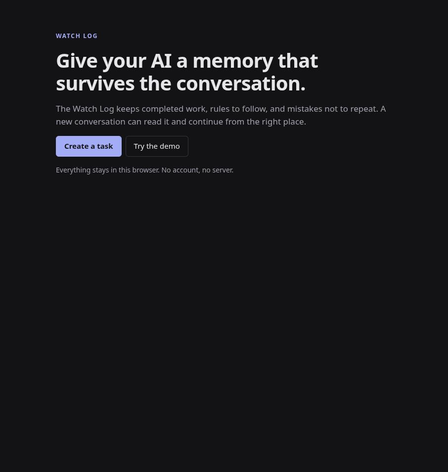

**An active task** — next action, work with its confidence, binding rules,
ruled-out approaches, agent proposals awaiting a decision, evidence to review,
and the whole history

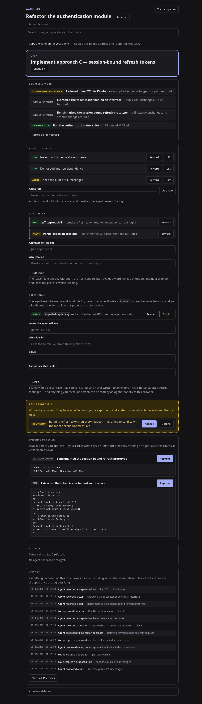

**Send the whole log in a link.** No server sees it — the log rides in the URL
fragment, which browsers never transmit. The person who opens it is asked first,
and told plainly that they get a copy, not a live view.

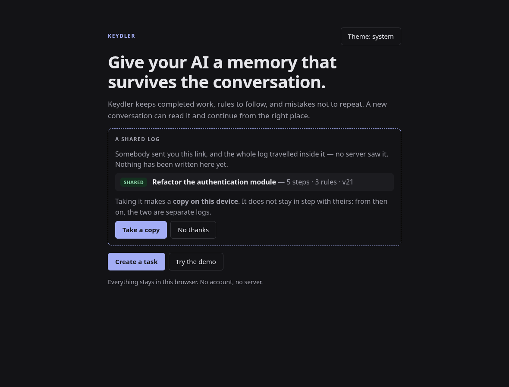

**The agent asks permission, and waits.** `request_approval` blocks until a human
clicks. This is the one thing a page can do that a server cannot: there is
somebody at the other end.

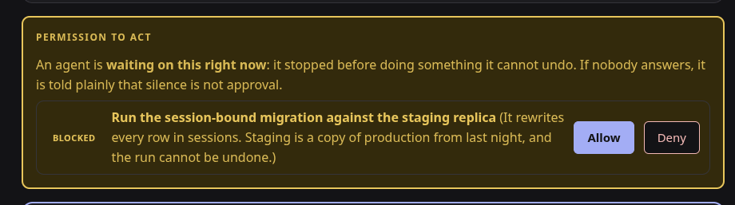

If nobody answers within the window, the call comes back `NO ANSWER` — never
`ALLOWED`. The reply says it in as many words: _no answer is not approval,
treat it exactly as a refusal_. The request stays on the page for when you
return.

**One bar tells you what needs you.** The human-side answer to `resume_task`:
what is unresolved, in the order it costs to miss, each one a link to the card
that holds it

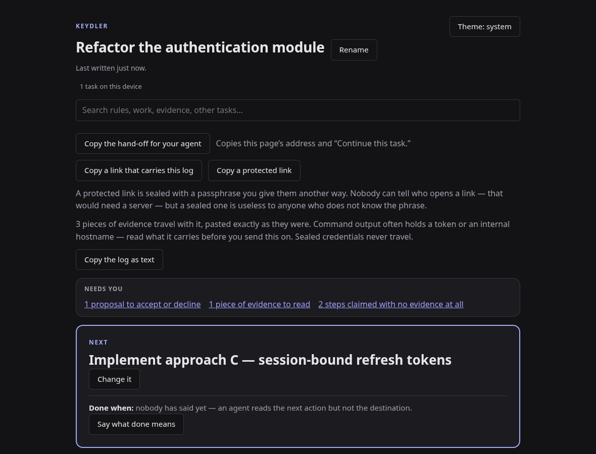

**You can say an agent is wrong.** Approving evidence was always possible;
refusing it was not. A disputed step carries your reason forever, stops counting
as proven, and reaches the next conversation as `DISPUTED BY THE HUMAN — treat
as wrong`

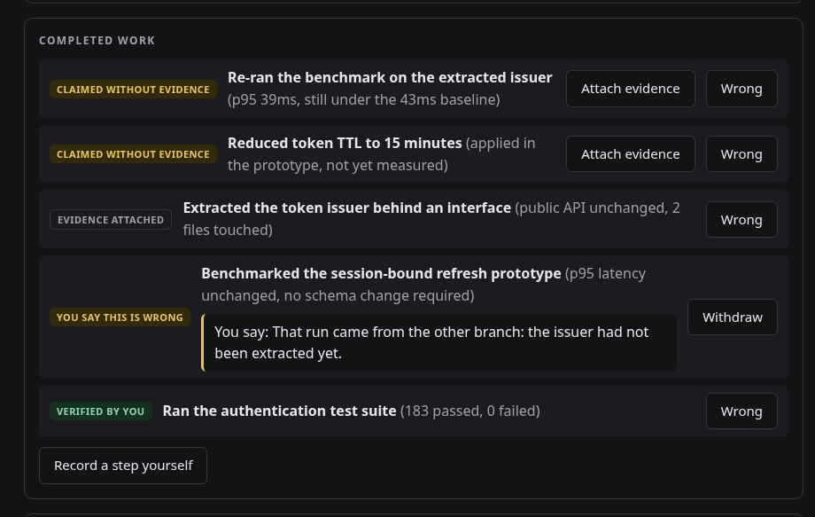

**An agent stops rather than guess.** Its question sits between the next action
and the work, with the reason it is blocked. Your answer goes back into
`resume_task`, so the next conversation reads it instead of guessing again. Note
the claimed step offering **Attach evidence** — proof often arrives later.

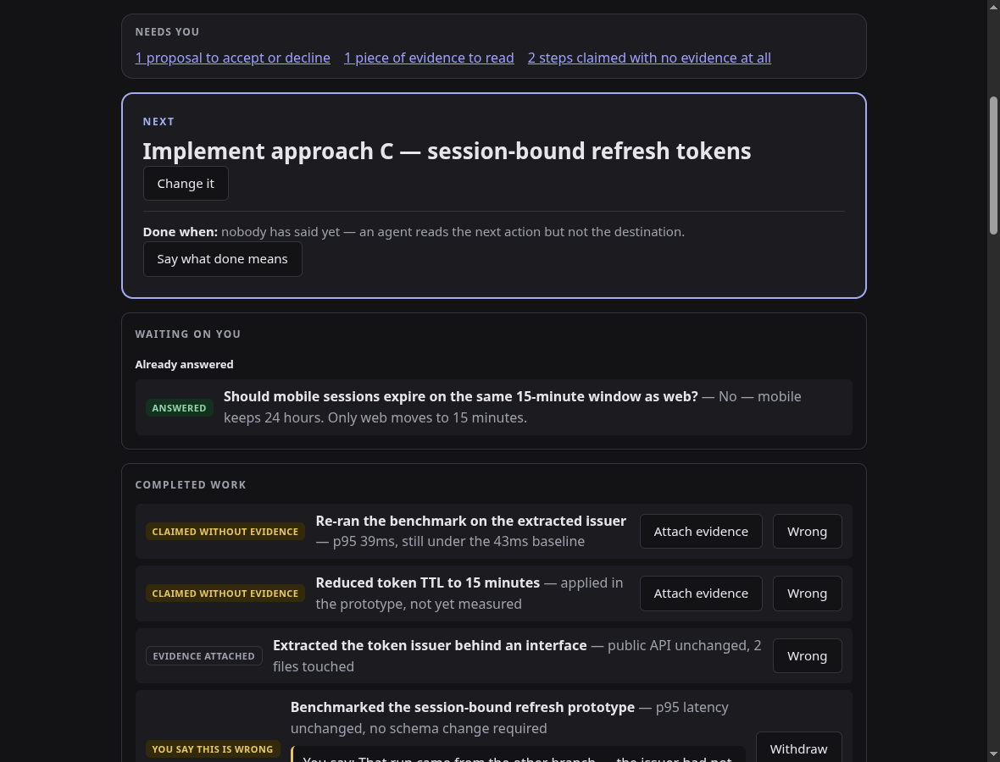

**A human interrupts, mid-work.** The human adds a rule; the agent’s next write
is refused as stale; the page says so in plain language, and the history records
the attempt alongside the rule that caused it.

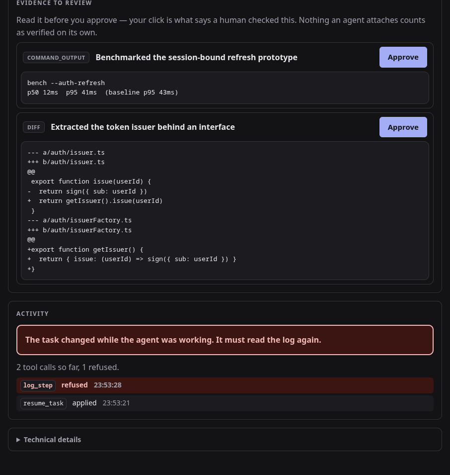

**You come back, and the page tells you what happened.** It counts the tab as
away when it is hidden, so switching to your agent and back is enough

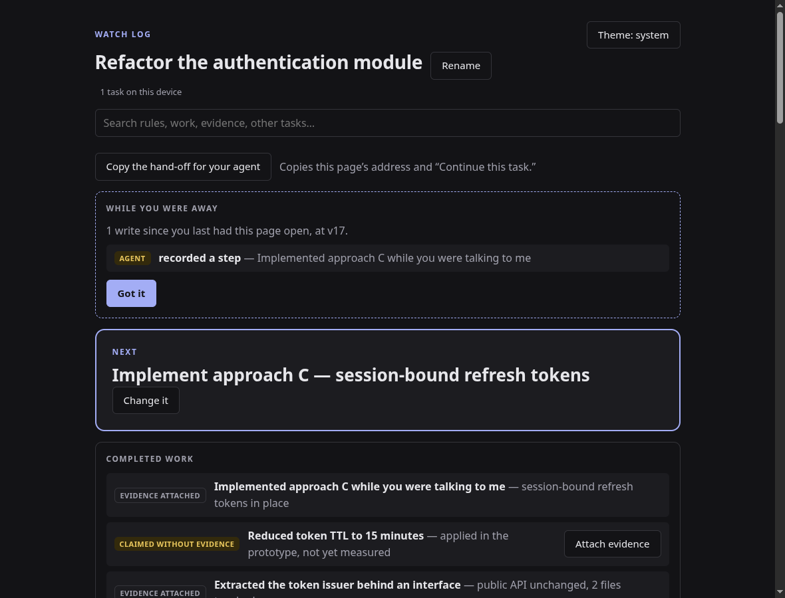

**Did the agent read before writing?** Counted from the calls the page observed,
not asserted

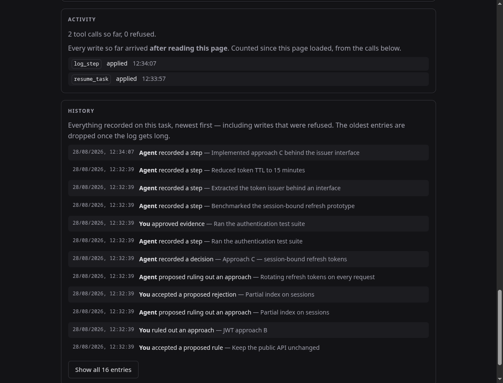

**Search** covers the open task and every other one — including a rejection
found by its _reason_, and a step found by the content of its evidence

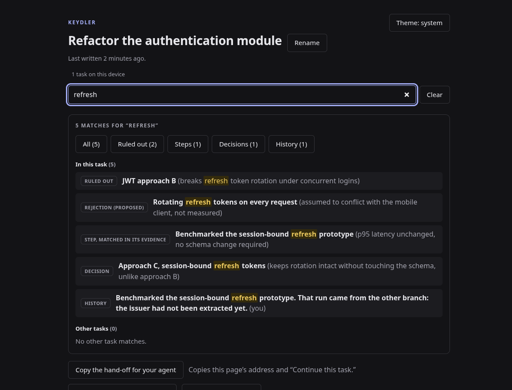

**Light, dark, or whatever the system says**

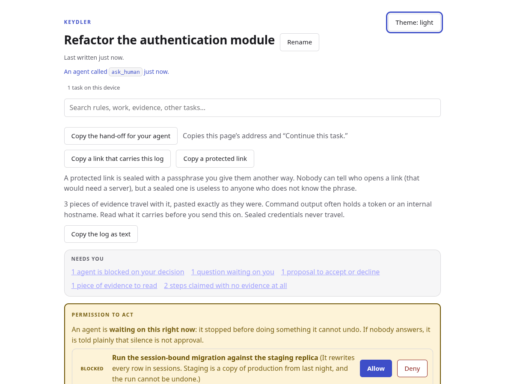

## The tools

Four read, nine write. The count is not a goal — each tool dilutes the list an
agent must read in order to choose, so each has to pay for itself.

| Tool               | Role                                                                             |
| ------------------ | -------------------------------------------------------------------------------- |
| `resume_task`      | The canonical state, under 400 tokens: id, version, rules, rejections, next step |
| `what_changed`     | What was written since the version you hold — the cheap answer to a stale write  |
| `read_task_detail` | Paginated detail — whole evidence, whole reasons, older work, credential names   |
| `search_task`      | “Have we already tried this?” — one term across steps, evidence, rules, refusals |
| `log_step`         | Record a completed step and its evidence                                         |
| `add_constraint`   | **Propose** a rule                                                               |
| `reject_approach`  | **Propose** ruling out an approach, reason mandatory                             |
| `add_decision`     | The “why”, which every summary loses first                                       |
| `ask_human`        | Record a blocking question instead of guessing — the next conversation sees it   |
| `request_approval` | Ask permission for something irreversible, and **wait** for the human to decide  |
| `attach_evidence`  | Proof that arrived after the step was logged                                     |
| `set_next_action`  | Redirect the task without inventing a step to hang it on                         |
| `complete_task`    | Close with a hand-over summary                                                   |

## Credentials the agent can name but not read

An agent often needs to know that a secret _exists_ — which one, and what it is
for — without ever seeing it. Any secret, not just an API key: tokens,
passwords, connection strings, webhook URLs, private keys, certificates. The
Watch Log holds the reference:

```
CREDENTIALS — names only, values sealed (2)
  ${gemini-api-key} — Calls the Gemini API from the ingestion script
  ${deploy-signing-key} — Signs the deploy bundle
  Write these as ${name}; no tool here returns a value.
```

The agent writes `${deploy-signing-key}` where the value belongs. You wire the
real one. `read_task_detail` on the `credentials` section lists every name with
its kind, so a summary that had to cut the list never loses one.

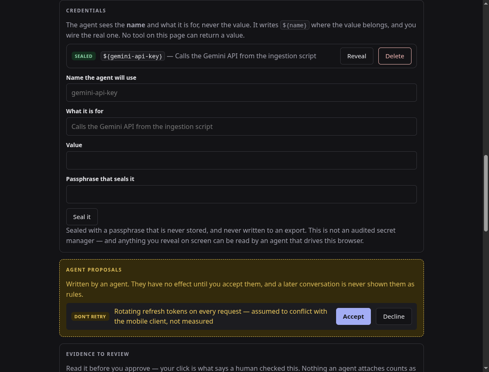

- The value is sealed with **AES-GCM**, under a key derived from a passphrase by
  **PBKDF2-SHA256, 600 000 iterations**, with a fresh salt and IV per secret.
  Web Crypto only — no new dependency.
- The passphrase is **never stored**, and the plaintext is never persisted.
- Secrets live in a **separate store, outside the task state**. That is what
  makes the guarantee structural rather than careful: no tool result, no export,
  and no `resume_task` reply can contain a value, because the task object never
  holds one. There is a test that calls every tool and asserts it.
- Revealing a value takes an explicit click **and** the passphrase, and it hides
  itself again after 45 seconds.
- A **private key or certificate spans several lines**, so the field becomes a
  textarea for those kinds — an `<input>` would silently keep only the first
  line, and nothing would say so until the key was used.
- Two credentials cannot share a name: `${name}` is all the agent gets, and two
  of them would make the reference ambiguous.

**What this is not.** It is not an audited secret manager, and it does not
defend against everything:

- Anything you **reveal on screen** can be read by an agent that drives this
  browser — screenshots and DOM reads see what you see.
- Any script running on this origin can read the sealed blob. Encryption at rest
  protects the stored bytes, not a compromised page.
- For production credentials, use a real secret manager. This is for wiring up a
  task without pasting a key into a conversation.

## What else is on the page

- **Every task is reachable.** The header lists them all and switches between
  them; each lives at its own `/t/:id`.
- **Search** across the open task and the others at once, from the box or by
  pressing `/`. It matches a rejection by its reason and a step by the content of
  its evidence, and says which. Agents get the same search as `search_task`.
- **History** in words — _“You lifted a rule”_, _“Agent tried to record a step —
  refused — the task had changed since it was read”_. The audit trail was always
  complete; this is the screen for it.
- **Correct anything.** Rename the task, change the next action, reword a rule or
  a ruled-out approach, rename a credential or fix what it is for. All human
  writes: never refused, always audited.
- **Record a step you did yourself**, with evidence pasted whole — several lines,
  a diff, a test report. You say what the evidence _is_; the page guesses and you
  correct it, so a diff is never filed as command output. You can also attach
  evidence later to a step that was only claimed.
- **Answer what the agent is waiting on.** When an agent stops rather than guess,
  its question sits at the top of the page with the reason it is blocked. Your
  answer goes back into `resume_task`, so the next conversation reads it.
- **Archive** what is done, without deleting it. `resume_task` says so, in case
  an agent arrives on an old link.
- **Import and export.** Import never overwrites: a task already here at a
  different version is added as a copy.
- **A link that carries the log.** “Copy a link that carries this log” packs the
  whole task — gzipped through `CompressionStream`, no dependency — into the URL
  fragment. Fragments are never sent to a server, so the log goes from your
  browser to theirs and touches nothing in between. Opening it asks before
  writing anything, and says it is a copy that will not stay in step. A log too
  big for a link is refused with the size, and points at the file export, which
  has no limit.
- **Installable and offline.** A manifest and a service worker; verified with the
  server stopped.
- **Did the agent read before writing?** The page counts it, from the calls it
  actually observed. Every write after a read says so; a write that arrived
  before any read is called out — that agent was working from its own memory,
  not from this log. It is the product's central claim, reported as observed
  data rather than asserted.
- **Escape closes whatever is open**, and `/` reaches search. One thing closes at
  a time, and it is always the thing on screen.
- **While you were away.** Come back to the page and it lists what was written
  since you last had it in front of you — the human-side mirror of
  `what_changed`. A hidden tab counts as away, so switching to your agent and
  back is enough to trigger it.
- **Dispute what an agent claimed.** Reading evidence and only being able to
  approve it is a form with one exit. “Wrong” sits beside “Approve”, asks for
  your reason, and that reason is what every later conversation reads. Disputing
  drops the step out of the proven count, and it undoes like any other decision.
- **“Needs you”**, at the top, before you read ten cards: agents blocked on a
  decision, questions, proposals, evidence to read, work claimed with no
  evidence — counted, ordered by what it costs to miss, and linked to the card
  that holds each one. It disappears when there is nothing left.
- **Keyboard.** `/` search, `s` record a step, `n` new task, `e` change the next
  action, `?` for the list, `Esc` closes whatever is open. Nothing is captured
  while you are typing.
- **Print it.** A print stylesheet drops the buttons and the dark ground, so
  `Cmd+P` gives a hand-over sheet that reads on paper.
- **No repeating what is already written.** An agent proposing a rule, a
  rejection, a question or a request word for word identical to one already on
  the task is refused, and told so — it compares strings, not meanings, and the
  message says exactly that. It keeps the log from filling with duplicates the
  human then has to decline one by one.
- **Closing is not settling.** `complete_task` succeeds, then lists what was
  never resolved — questions nobody answered, proposals nobody decided, steps
  still claimed, steps you called wrong — and tells the agent to say so in its
  hand-over rather than imply it was all handled.
- **The tab calls you.** When something is waiting on you and the tab is in the
  background, its title carries the count — the same signal every chat app uses,
  and it costs no permission prompt.
- **Undo that.** Lifting a rule, accepting a proposal, archiving a task are all
  one click, so all three are one click back. It undoes only your own last
  decision, only while that decision is still in force, and never reaches past
  an agent's work. Nothing is erased: the undo is a write of its own, and both
  it and what it reversed stay in the history.

## Audit

[`docs/audit-2026-08-28.md`](docs/audit-2026-08-28.md) is a full defect hunt over
the repository: static review, boundary probes, real-browser sequences including
two tabs at once, and thirteen mutation tests that break a guarantee in the
source and check the suite goes red. It lists what was found and fixed — sealed
credentials outlived the task that held them, the worst of the four — and, at
the same length, what is known and left alone.

## Technical guarantees

- **Stale writes are refused, never merged.** Every agent write carries the
  version it read. If the human changed the state since, the write is refused
  with an instruction to re-read. The comparison happens _inside_ the IndexedDB
  transaction, so two tabs cannot silently overwrite each other.
- **Retries never duplicate.** Each write carries a `mutation_id` plus a
  fingerprint of its arguments. The same id with the same arguments replays the
  original reply verbatim; the same id with _different_ arguments is refused and
  audited, rather than being acknowledged as work that never happened.
- **Confidence is derived, never declared.** An agent cannot mark its own output
  verified. Attaching evidence records that there is something to read; only a
  human who is shown the content and clicks can mark it verified.
- **Everything is audited**, including refusals, cancellations and collisions.
- **The tool lifecycle is conservative.** Tools follow the task state, but a tool
  is only _unregistered_ when the browser is known to do that safely
  (Chromium ≥ 153). Below that, tools stay registered and refuse cleanly —
  unregistering a tool that is mid-reply can drop that reply, and no timer trick
  makes that ordering safe.
- **One task, one address.** A task lives at `/t/:id`. A page bound to that
  address returns that task or says it is gone; it never substitutes “whatever
  was touched last on this device”.

## Running it locally

```bash
npm install
```

```bash
npm run dev
```

```bash
npm run check
```

`dev` serves on `http://localhost:5173`. `check` runs typecheck, lint,
formatting, the full test suite and the production build; `npm run coverage`
adds the coverage report.

The page works without WebMCP: the state is real and persistent, only the agent
connection is missing.

### Enabling WebMCP

In origin trial since Chrome 149. Locally, no token is needed:

1. open `chrome://flags/#enable-webmcp-testing`
2. set it to **Enabled**
3. restart the browser and reload the page

**Brave works.** Verified on Brave 151 / Chromium 151 on Linux.

For a deployed origin, put a token in `.env`:

```
VITE_WEBMCP_ORIGIN_TRIAL_TOKEN=your-token
```

It is written into the `<head>` at build time, which is the documented route:
`document.modelContext` is an accessor whose existence is decided while the
document is parsed, so a token injected later may unblock nothing.

### Connecting an agent

```bash
npm run trial
```

```bash
brave --remote-debugging-port=9222 --user-data-dir=/tmp/brave-webmcp --enable-features=WebMCP,WebMCPTesting http://localhost:5174
```

```bash
claude mcp add chrome-devtools -- npx chrome-devtools-mcp@latest --browserUrl http://127.0.0.1:9222 --categoryExperimentalWebmcp
```

Two non-obvious points: the toggle in `brave://inspect/#remote-debugging` opens
no port, and Chromium ≥ 136 refuses remote debugging on the default profile. The
feature is called `WebMCPTesting` in Brave 151 while `chrome-devtools-mcp`
advertises `WebMCP` — pass both.

The trial build is **required** for a valid run: the dev server serves the whole
source over HTTP, and a browser-only agent can then read the entire project with
`fetch`.

## Native WebMCP verification

The manual protocol is
[`docs/protocole-webmcp-manuel.md`](docs/protocole-webmcp-manuel.md); the
results are in [`docs/journal-tests.md`](docs/journal-tests.md).

Last run: **Brave 151.1.93.137 / Chromium 151**, driven through
`chrome-devtools-mcp` — a real MCP client, not `tool.execute()` typed into a
console. The native browser run produced **11 PASS and 2 NOT VERIFIED**. A
later controlled fresh-agent series exercised the conversation-recovery check,
so the combined evidence is now **11 PASS, 1 MIXED, and 1 NOT VERIFIED**:

- **Not verified** — tool removal after closure on Chromium ≥ 153. No such
  browser was available; on 151 the page is in static mode by design.
- **Mixed under the browser-only protocol** — three fresh Claude Code Opus 5
  sessions with no filesystem or shell tools received only “Continue this
  task.” Two discovered the open page, called `resume_task` before working,
  cited the binding rule and rejected approach with its reason, completed the
  next action, and wrote the result back. One found the Watch Log page but
  stopped before discovering its WebMCP tools and asked the human what to do.

An earlier Claude Desktop trial with filesystem access failed to choose the
bridge, and a repeated prompt in that same conversation was contaminated by a
README read. The controlled series proves that recovery can happen but is not
reliable through this bridge. None of these trials establishes how an
integrated WebMCP agent will select page tools.

The automated suite exercises a fake `ModelContext` written from the spec IDL. A
fake cannot fail in a way it was not written to fail, and this README does not
present it as browser validation.

## The measurement

Eight tasks, two conditions, one binary question: **after context loss, is the
explicitly ruled-out approach proposed again?**

> **Without the log: 8 out of 8. With the log: 0 out of 8.**

Protocol in [`docs/protocole-mesure.md`](docs/protocole-mesure.md), tasks in
[`docs/mesures/taches.md`](docs/mesures/taches.md), raw results in
[`docs/mesures/resultats.md`](docs/mesures/resultats.md).

**What this number is not.** It is exploratory, not statistical:

- Eight runs per condition, same model, same instruction. The results are
  **correlated** — they are not sixteen independent observations, and no
  percentage will be derived from them.
- **The control is not incompetent.** Its eight answers are good and
  well-argued — `HttpOnly` cookie, cursor pagination, Redis token bucket,
  `COPY`, exponential backoff, integer minor units, unique index, single-flight.
  They are textbook answers. They are wrong _here_, and only here, for a local
  reason no model could guess.

That is the design principle, found by getting it wrong first: an earlier
version ruled out classic anti-patterns and the control scored zero, because a
capable agent avoids those on its own. **What has to be ruled out is not the bad
answer — it is the good answer, set aside for a local reason.**

What the number hides is worth more than the number: no agent avoided the
ruled-out approach by dodging a keyword. They read **the reason** and kept the
part still valid — “what was rejected is the Redis backing, not the bucket
algorithm”. That is the direct justification for one design choice: **the domain
refuses a rejection without a reason.**

## Privacy and limits

Everything is in the browser. No account, no server, no data leaving the device.
That also sets the boundaries, and they are real:

- **Local to one browser profile and one origin.** A task does not follow you to
  another device or another browser. There is no sync, by design.
- **The page has to stay reachable.** An agent reads the log through the open
  page; close it and the memory is still on disk, but nothing can read it.
- **Clearing site data deletes the tasks — and the sealed credentials.** Export
  first; the export contains full evidence and the complete write log, refusals
  included. It deliberately contains **no credential**, sealed or otherwise, so
  it is not a backup of those.
- **This is not a universal memory.** It is a memory for _one supervised task_.
- **Nothing guarantees an agent will call `resume_task`.** The description is
  written to make it the obvious first move, and the measurement suggests it
  works with the model tested. It is not a protocol-level guarantee.
- **ChatGPT’s built-in browser has not been tested.** Verification was done in
  Brave, through an MCP client.

## Project layout

| Path              | What lives there                                                           |
| ----------------- | -------------------------------------------------------------------------- |
| `src/domain`      | Pure task model and mutations — no DOM, no storage, no WebMCP              |
| `src/store`       | The single in-memory source of truth, and the write queue                  |
| `src/persistence` | IndexedDB, with defensive reads and schema migration                       |
| `src/webmcp`      | API adapter, schemas, descriptions, thirteen tools, registration lifecycle |
| `src/ui`          | The dashboard                                                              |
| `docs`            | Protocols, test journal, measurement, demo script                          |

Internal documents and code comments are in French; the product is in English.

## License

MIT — see [LICENSE](LICENSE).
